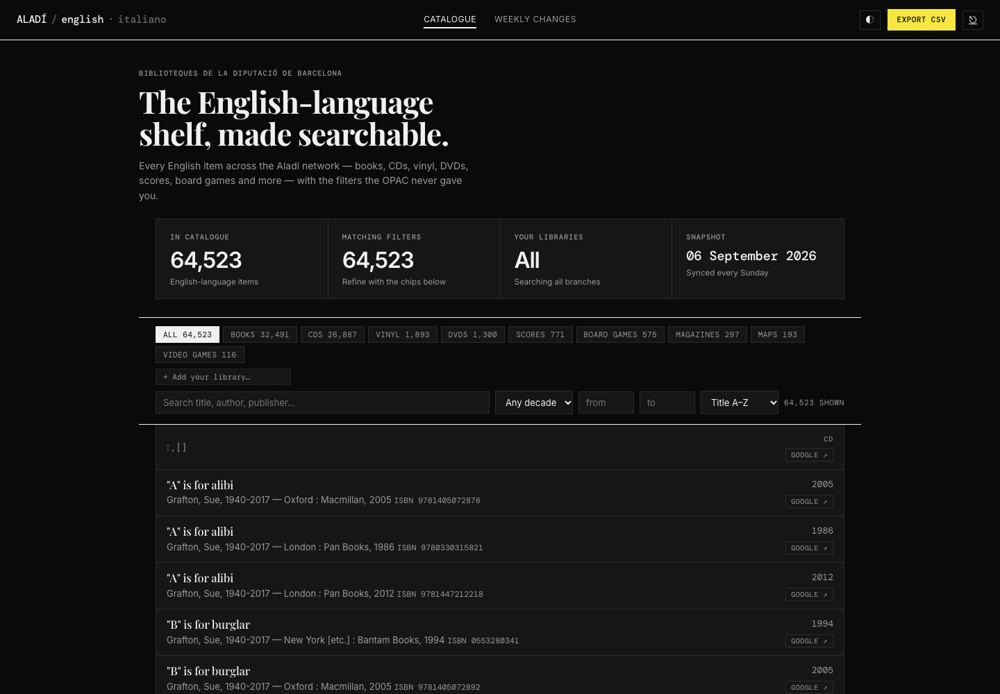
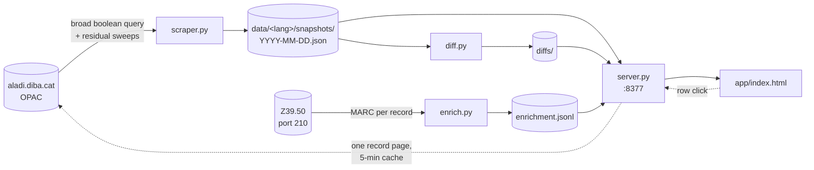
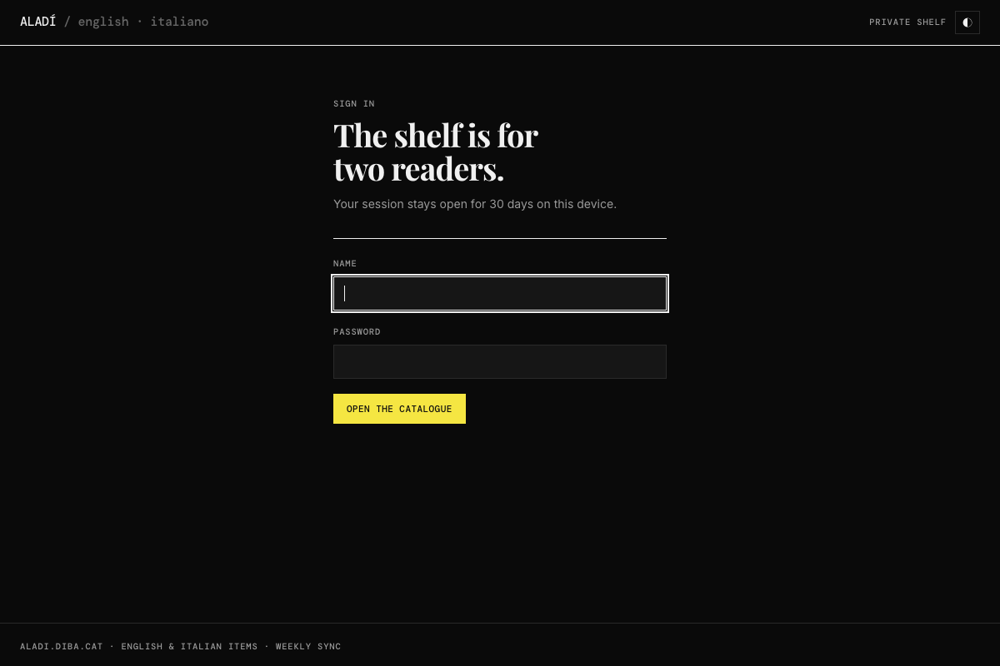

<div align="center">

# Aladí Catalogue

**Every English-language item in Barcelona's public libraries, on one searchable shelf.**

The Aladí OPAC (aladi.diba.cat, 249 municipal branches) has no way to browse by language — its language filter only sits on top of a keyword search. This app rebuilds the whole English (and Italian) catalogue as a weekly snapshot, enriches each record over Z39.50, and puts the filters the real site never had in front of it: type, genre, audience, decade, *your* libraries, and live shelf availability on click.

&nbsp;&nbsp;&nbsp;&nbsp;



</div>

| | What you get | Where it comes from |
|:-:|---|---|
| ⌕ | **Instant search** over title · author · publisher, diacritic-insensitive, with year range and sorting | the weekly snapshot, held in the browser |
| ▤ | **Type chips** — books, CDs, vinyl, DVDs, scores, board games, magazines, maps, video games, each with a live count | material code from the OPAC search results |
| ✦ | **Genre + audience chips** for books (crime, SF/fantasy, romance, history, tech, kids…) | MARC `008` + Catalan subject headings, over Z39.50 |
| ◫ | **My libraries** — pick your branches and every count narrows to what they actually hold | holding codes from MARC `907 $i` |
| ● | **Live availability** on row click: each copy's library, call number and status (`Available`, `DUE 14-08-26`, `In Transit`) | the record page, fetched once per click, cached 5 min |
| Δ | **Weekly changes** — what entered and left the catalogue between snapshots | `diff.py` over the two newest snapshots |
| ⇣ | **CSV export** of whatever is currently filtered, and a Google-search button per row | the browser |

Switch catalogue from the wordmark: `ALADÍ / english · italiano`. Adding a language is one registry entry plus a scrape — [docs/adding-a-language.md](docs/adding-a-language.md) is the runbook (and explains why Catalan and Spanish, at 300–450k items, are deliberately out).

## Run it

```bash
python3 scraper.py                 # full English sync → data/eng/snapshots/  (~45 min, 4 workers)
python3 enrich.py                  # MARC enrichment over Z39.50 → data/eng/enrichment.jsonl
python3 server.py                  # open http://localhost:8377
```

Pure Python standard library. The one binary dependency is [`yaz-client`](https://www.indexdata.com/resources/software/yaz/) for Z39.50 (`brew install yaz` / `apt install yaz`); the `Dockerfile` bakes it in. Every script takes `--lang=<code>` (default `eng`); `./run_weekly.sh` chains scrape → diff → enrich for each language in `$ALADI_LANGS`.

## How it works



Four scripts connected only by JSON files on disk; the UI is a single HTML file that loads the whole snapshot once and filters in memory.

<details>
<summary><b>Getting "everything" out of an OPAC that caps results at 32,000</b></summary>
<br>

The catalogue is classic Innovative Millennium: it requires a keyword, has no list-all, and truncates any result set at 32k. The trick is one broad boolean query of the language's commonest stopwords — English `and OR the OR a OR in OR de OR of` returns ≈28.6k books, Italian `e OR di OR la OR il OR che OR un …` ≈5.3k — run once per material type, then **residual sweeps** of the form `term AND NOT (main query)` to catch records whose indexed text contains none of the main words. Everything is deduplicated by bib record id.

Coverage is near-total rather than provably complete: a record containing none of the probe words would be missed. The sign that the main query already reached nearly everything is that the residual sweeps return single-digit extras — which is what Italian shows.

Two things that bit: author lines carry lifespans (`Grafton, Sue, 1940-2017`), so imprint detection has to run on the *imprint* line, not the first thing that looks like a year; and `S171*eng` in every OPAC URL is the site's **interface** language, which stays `eng` for every catalogue — the item language is the separate `l=` parameter.

</details>

<details>
<summary><b>Genres from Catalan subject headings, for every language</b></summary>
<br>

Z39.50 is the sanctioned machine interface to the catalogue, and the MARC it returns is far richer than the HTML: `008` gives literary form and target audience, `6xx` gives the subject headings, `907 $i` gives the holding libraries. The headings are in Catalan regardless of the item's language, so one set of genre rules serves English and Italian alike.

The rules key off **stems** on diacritic-folded text because Catalan plurals shift spelling (`policíaca` → `policíaques`), and the middot in `l·l` is not a sentence end. Folding has its own trap: `italia` matches both *Italià* (the language) and *Itàlia* (the country). The catalogue writes a language as the heading (`Italià — Gramàtica`) and a country as a subdivision (`Música popular — Itàlia`), so position is the signal. After any rule change, `enrich.py --rederive` recomputes every genre locally from the stored subjects — no network — and the counts are diffed before and after, because a rule that looks right can move hundreds of records.

</details>

<details>
<summary><b>Why it's behind a login</b></summary>
<br>

<div align="center"></div>

The OPAC's `robots.txt` disallows `/search` and `/record=`: the library network does not want its catalogue indexed or mirrored. A personal tool with a weekly sync is within the spirit of that; a public mirror is not — and every availability lookup is a live request to the library's servers, which must stay one-per-click, never anything a stranger can drive. So the deployment is private by design, and the code is what's public.

The login is in `server.py` with no framework: PBKDF2-SHA256 passwords, a signed 30-day session cookie (`HttpOnly`, `SameSite=Lax`, `Secure` behind TLS), lockout per IP, per username and globally after repeated failures, constant-time verification against a dummy hash for unknown usernames, and `noindex` / `nosniff` / frame-deny / `no-store` on every response. It **fails closed**: with `ALADI_REQUIRE_AUTH=1` the server refuses to start unless a valid user list parsed, so a mis-escaped `$` in an env file can never silently open the site. Sessions are signed over the password hash, so changing a password signs that user out everywhere.

```bash
python3 server.py --hash-password         # → pbkdf2$200000$<salt>$<hash>
ALADI_USERS='me:pbkdf2$…' ALADI_SECRET=… python3 server.py
```

</details>

<details>
<summary><b>Politeness rules the scraper lives by</b></summary>
<br>

- **4 workers**, one full sync a week, per language — about 2,500 requests for English, a tenth of that for Italian. Roughly 5k requests a run has drawn zero blocks; the risk is server-side throttling if concurrency is raised, so it isn't.
- **Z39.50 for bulk record data.** It is the interface built for machine queries. Result sets cap at 500 per search, so enrichment is per record, not enumeration.
- **Availability is on demand only.** One request per click, five-minute cache, never bulk-polled.
- **No public mirror** — see the login section above.
- Need more than personal use? Ask the Diputació de Barcelona for an export rather than scaling this up.

</details>

## Running in production

The app runs as a Docker Compose stack on a small VPS behind a shared Caddy that owns TLS, at a private subdomain with the `noindex` header set twice over. `data/` on the box is the source of truth — the weekly cron (`Sunday 07:30`, Europe/Madrid) scrapes there, and `deploy/push.sh` syncs code only.

| Task | How |
|---|---|
| Deploy a code change | `deploy/push.sh root@<box>` (rsyncs code, rebuilds, restarts; never touches `data/`, `logs/`, `.env`) |
| Watch the app | `ssh root@<box> docker logs -f aladi-web-1` |
| Check the weekly run | on the box: `tail /srv/aladi/logs/cron.log`, `ls /srv/aladi/data/eng/snapshots/` |
| Run the weekly job by hand | on the box: `docker compose -f deploy/compose.yaml run --rm jobs` (a full scrape of every language — don't do this casually) |
| Sync one language only | `docker compose -f deploy/compose.yaml run --rm -e ALADI_LANGS=ita jobs` |
| Add or change a login | `python3 server.py --hash-password` → write `name:hash` into `ALADI_USERS` in `/srv/aladi/.env` **with every `$` doubled to `$$`**, then `up -d` |
| Sign everyone out | change `ALADI_SECRET` in `.env`, then `up -d` |

> [!TIP]
> Compose interpolates `.env` files, hence the `$$`. If a hash is mis-escaped the container exits with a message naming the problem instead of starting with the login off — that's `ALADI_REQUIRE_AUTH=1` in `deploy/compose.yaml` doing its job. Local dev (`python3 server.py` with no env) has no login at all.

---

<div align="center">

[Adding a language](docs/adding-a-language.md) · [MIT License](LICENSE)

</div>
